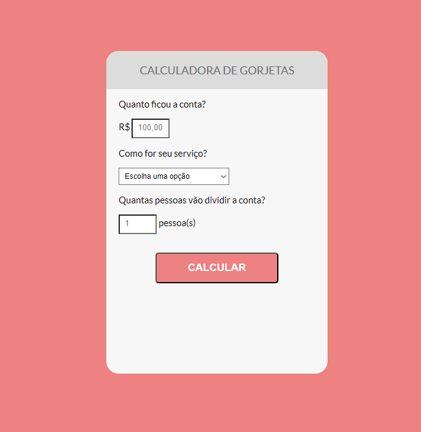

<h1 align="center"> Calculadora de Gorjetas </h1>

Programa exclusivo e gratuito, promovido pela OneBitCode para ensino de tecnologias WEB.  

  <a href="#-tecnologias">Tecnologias</a>&nbsp;&nbsp;&nbsp;|&nbsp;&nbsp;&nbsp;
  <a href="#-projeto">Projeto</a>&nbsp;&nbsp;&nbsp;|&nbsp;&nbsp;&nbsp;

 

  

## 🚀 Tecnologias

Esse projeto foi desenvolvido com as seguintes tecnologias:

- HTML e CSS
- JavaScript

## 💻 Projeto

A Calculadora de Gorjetas é para avaliar o trabalho feito pelo garçom e realizar o calculo da porcentagem da gorjeta com a quantidade de pessoas que vão pagar a conta.

- [Acesse o projeto finalizado, online](https://kenichi07.github.io/projetoOneBitCode/)

---

Feito com ♥ by Vinicius 